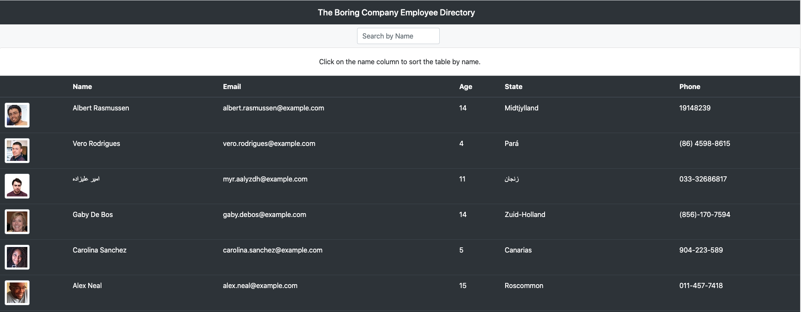

# React Employee Directory
The following is a react based web application that allows a user to search and sort through an employee directory. It mimics an employee directory by using the very popular 
[random user generator api](https://randomuser.me/). 

# Description

This was a great project to work through and it really helped me to learn and understand how react worked. I learned a lot about when to use a class vs a 
functional component, how to use and set state, some react component lifecyle methods and much more. 

# Usage 

Usage of the app is pretty simple. When the user views the page, they are brought to a page containing a search bar and table of all the employees in their company. Now it just shows 
50 employees because that what was set as a parameter in the API call. A user can click on the name column in the employee table to sort the employees alphabetically from a-z or z-a. They can also search for a name in the search bar and the table will re-render to show the employee that matches what was typed into the search bar. 

# Tech Used 

* Good ol fashioned Array Prototype Methods 
* React 
* Random User Generator API 
* gh-pages npm package
* axios npm package for running api requests

# Screenshot of app

# Link to deployed app
Click [Here](https://v-lax.github.io/React-Employee-Directory/) to access deployed app. 